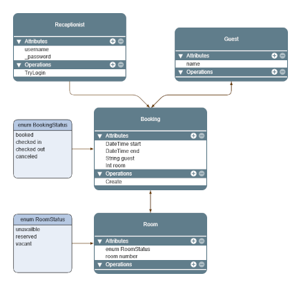

# Hotel_State_Manager
A console based program written in C# (.NET 9) where users manage hotel bookings, guest check-in/out and room availibility.

### System requirements
- [ ] login
- [ ] list all occupied rooms
- [ ] list all vacant rooms
- [ ] book a guest in a vacant room
- [ ] check out a guest from a booked room
- [ ] mark a room as temporarily unavailible
- [ ] save data automatically as changes occur
- [ ] utilize enums for room status

### Objectives

The program was created for learning purposes. Specific learning objectives inlcude develping an understanding for programming concepts, git utilization and file system management.

### User background

The program is intended as a complement to an existing system. Feature functions are focused on the present as opposed to furture bookings and will be utilized by a recpetionist to carry out the tasks as listed in System Requirements.

## Quick guide
Follow on screen console prompts throughout the system. Menus display key characters for user selection to navigate the program.

## Design Structure

### Data
The project uses CSV files for persistent data storage. Changes are saved as they occur. Each classes' data is saved by that class. This saving structure allows each class to exist independently of each other, as a seperate componet, which are joined together in the Booking Class.

### Project structure

**Guest Class**

In the future the Guest Class would be beneficial in facilitating guests' ability to login and view thier booking requests althought this is not a current system requirement.

**Receptionist Class**

Since the current project is an extention of a larger framework, this class will tie into the existing design structure. The program is designed from the receptionist's perspective as the end user. The login information for these users is stored in this Class.

**Room Class**

The Room Class stores information about a room's status. Potential statuses include: Reserved, Occupied, Vacant or Unavailable. Reserved rooms are associated with a booking in which the guest has not checked in. Occupied rooms have a checked in guest. Vacant rooms are available, unoccupied and unreserved. Unavailible rooms have been removed from rotation for scheduling by the receptionist for maintenance or another reason.

At program start the following rooms have the following status:
- 101 Vacant
- 201 Reserved
- 202 Occupied
- 213 Unavailible

**Booking Class**

The information required to fullfil a customers booking request is stored in the Booking Class. This information includes guest name, room number, booking status, the receptionist responsible for the booking as well as start and end times for the reservation. Room status is retrieved from the Room Class.

**Class UML**

Fullview of the UML class diagram can be accessed [here](https://www.yworks.com/yed-live/?file=https://gist.githubusercontent.com/hkmp1303/7178e6128c76b07bfff16a984a47908d/raw/62283e5daa590a48e0cdeb0ad9f22c6967065088/Hotel%20System) from yworks.

## Known Issues

- Bookings
  - Bookings timestamps do not consider different timezones. As a result entires could be erronously entered in the wrong timezone. Converting user inputs to a standard UTC time, would resolve this issue.
- Room
  - The room selcting method does not consider availiblity based on time which could result in double bookings for any given room.
